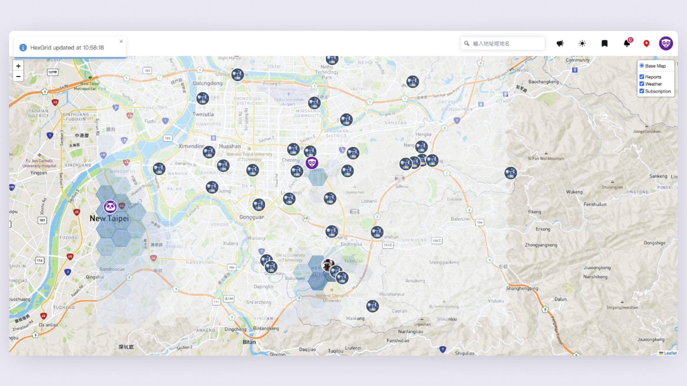
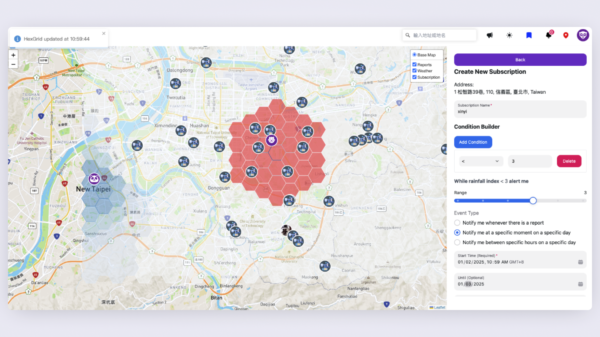
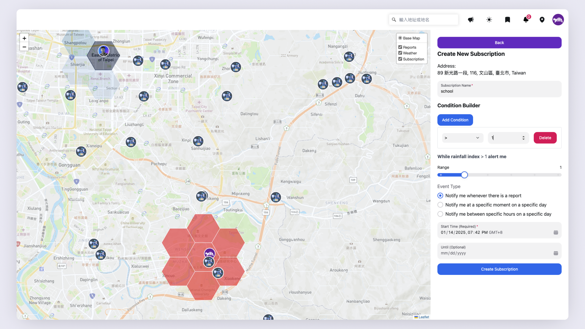
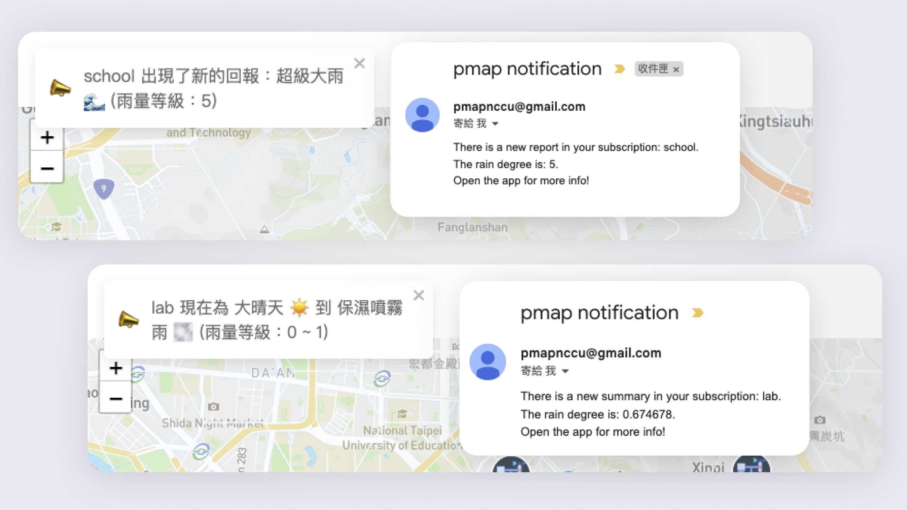
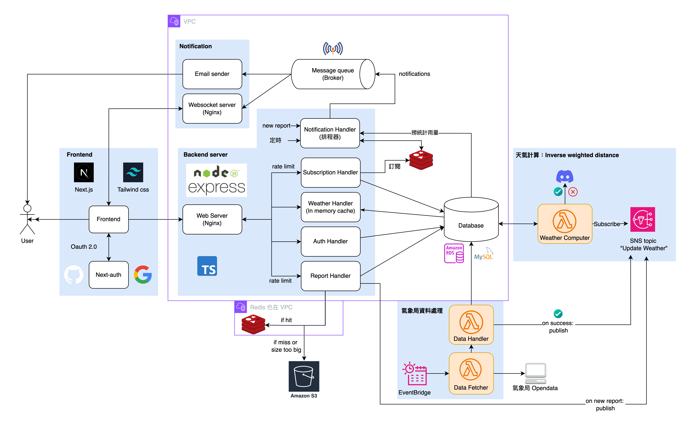
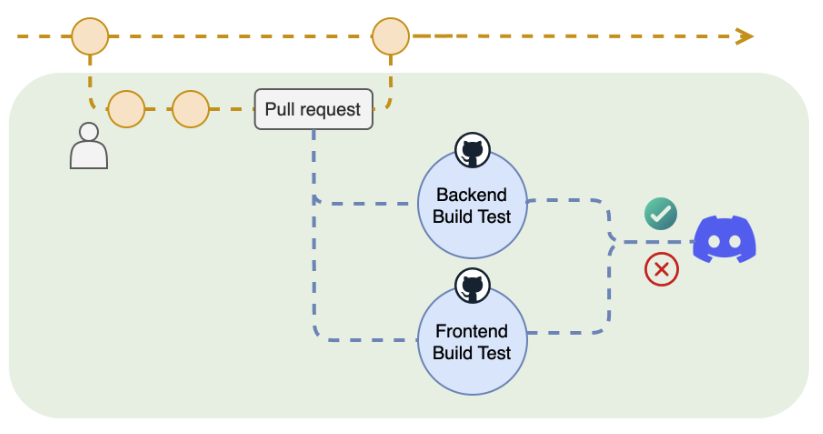
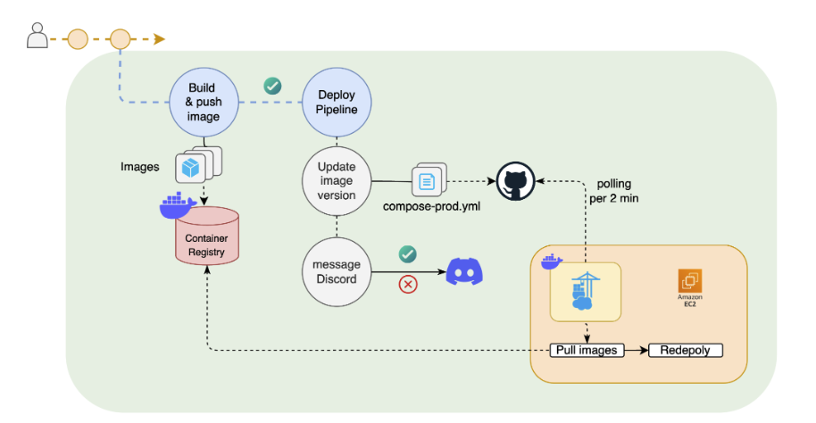

# Pmap: the map for Precipitation 🌦️


1. 透過「民眾回報」和「氣象局資料」計算雨況，提供更精準的雨況資訊
2. 提供「定期」「定點」的雨況訂閱與通知


## Table of contents
- [Pmap: the map for Precipitation 🌦️](#pmap-the-map-for-precipitation-️)
  - [Table of contents](#table-of-contents)
  - [Main Features](#main-features)
  - [Demo \& Screenshots](#demo--screenshots)
  - [System Architecture](#system-architecture)
  - [Built with](#built-with)
  - [CI/CD](#cicd)
  - [Getting Started](#getting-started)
  - [Documentation](#documentation)
    - [小組作業目錄](#小組作業目錄)


## Main Features

- 即時雨況地圖
  - 包含氣象局資料與民眾回報
- 回報即時雨況資訊與照片
- 提供地區雨況訂閱功能，發送站內通知與 email
  - 支援某地區的**新回報**通知
  - 支援某地區的**定時**雨況通知
  - 支援設定**雨量條件**與**關注地區範圍**
- Dark mode

## Demo & Screenshots

- Report and map


- Map
  


- Subscription




- Notifications



## System Architecture



**Code structure:**
- Frontend: [frontend](./frontend)
- Backend: [backend](./backend)
- Notification: [notificationServer](./notificationServer/)
- Lambda related: [cloud](./cloud/)

## Built with

Primary Language: **TypeScript**

**Frontend**
- Next.js
- Leaflet
- NextAuth.js
- Tailwind

**Backend server and notification**
- Express
- Redis
- MySQL
- MQTT
- AWS s3
- Socket.IO

**Cloud Services**
- AWS CDK
- AWS Lambda
- AWS SNS
- AWS EventBridge

**CI/CD**
- Docker
- Github action
- Portainer

## CI/CD 

**CI pipeline**


**CD pipeline**


---

## Getting Started

1. **Check Environment Variables**  
   Make sure each `.env.dev` file in the folders is correctly set up as per `.env.dev.example`.

2. **Install Dependencies**  
   If dependencies are not installed yet, run the following commands:
    ```shell
    cd backend
    npm install
    cd ../frontend
    npm install
    ```

3. **Start backend and frontend**  
   Run the following command to start:
    ```shell
    cd backend
    npm run dev
    ```

4. **(Optional) Start Cloud Services Locally**  
   To run services like weather computing and open weather data processing locally, use:
    ```shell
    cd cloud
    npm run local
    ```


---

## Documentation

| Docs                                          | Description                                                    |
| --------------------------------------------- | -------------------------------------------------------------- |
| [Backend Structure](docs/backend_structure.md) | Overview of the backend architecture and development workflow      |
| [Frontend Structure](docs/frontend_struture.md) | Overview of the frontend architecture and development workflow     |
| [CI/CD with Portainer](docs/cicd.md)           | CI/CD pipline and overview of Portainer and how to use it    |
| [AWS CDK and Lambda workflow](docs/api_doc.md)          | Overview of the CDK and Lambda deployment workflow |
| [API Documentation](docs/api_doc.md)          | Brief overview of the project's API documentation              |


### 小組作業目錄

| No         | Folder                                    |
| ---------- | ----------------------------------------- |
| 小組作業 1 | [planning-01](docs/planning/planning-01/) |
| 小組作業 2 | [planning-02](docs/planning/planning-02/) |
